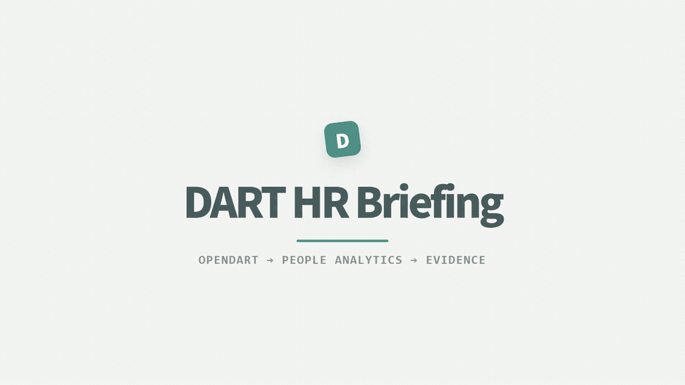
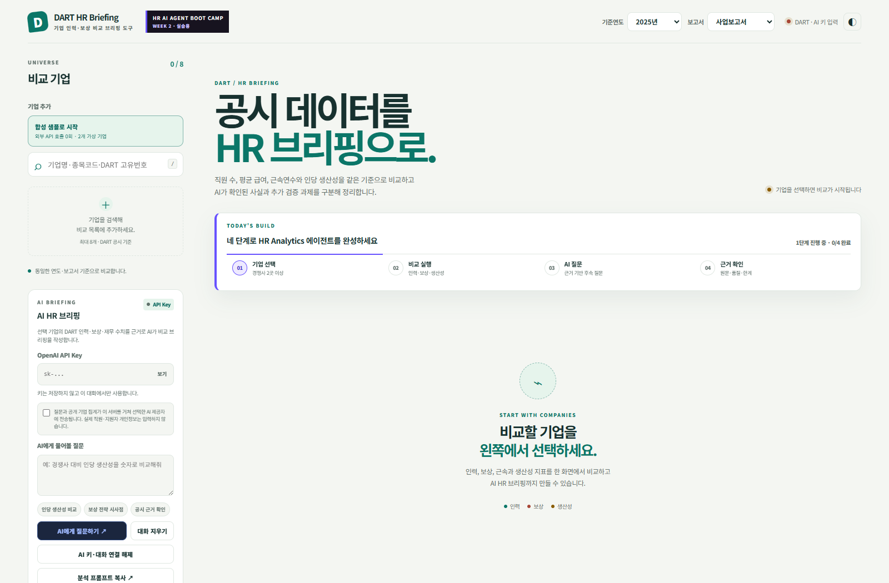
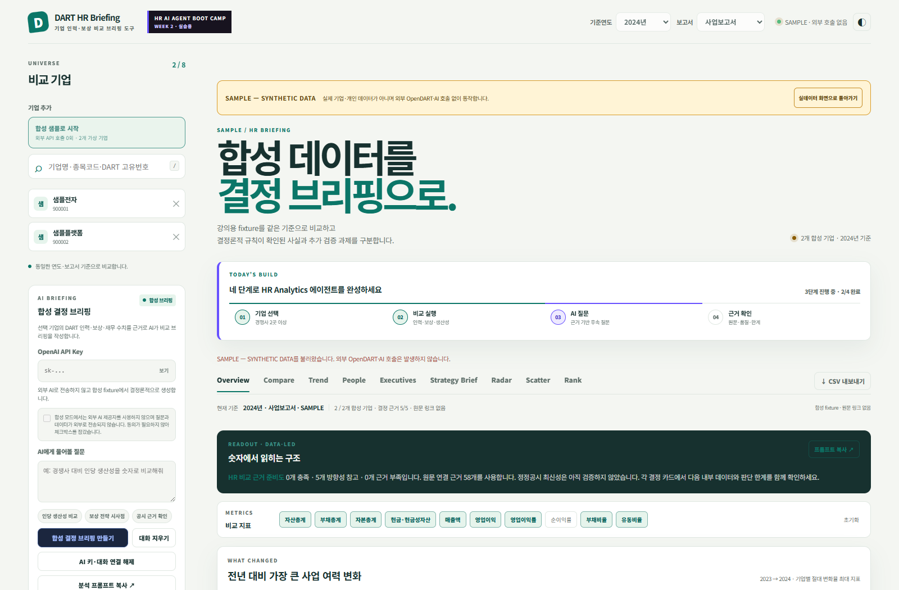
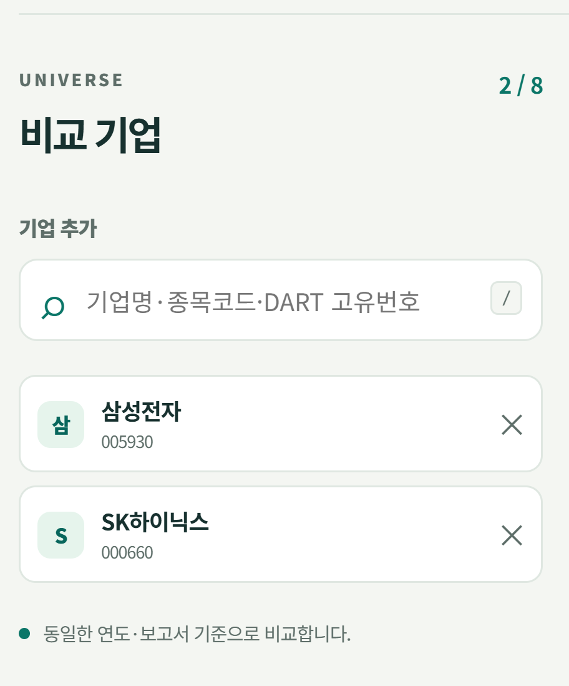
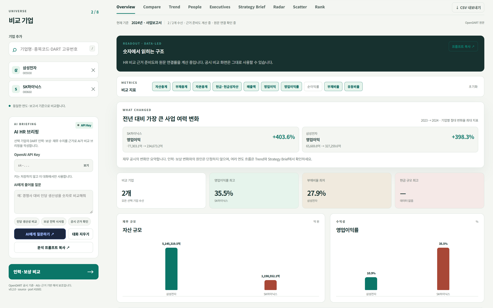
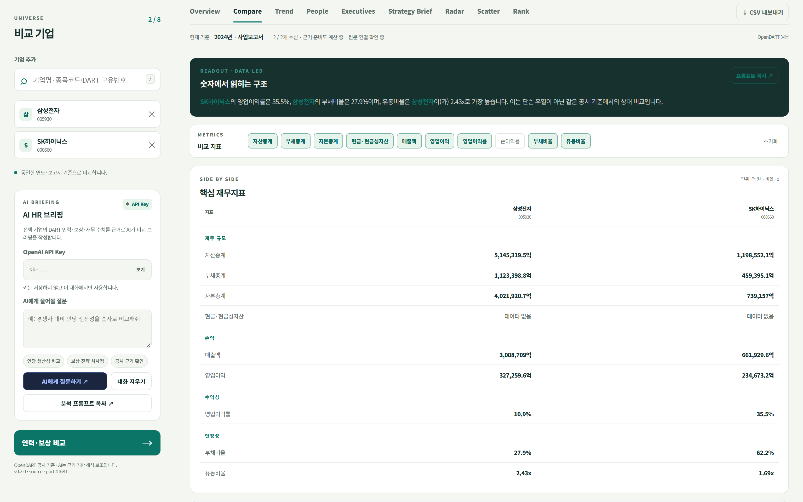
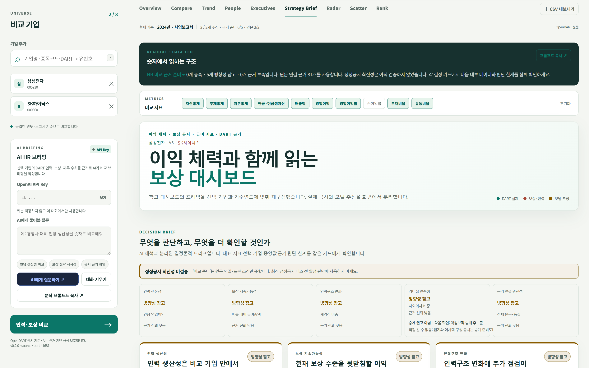
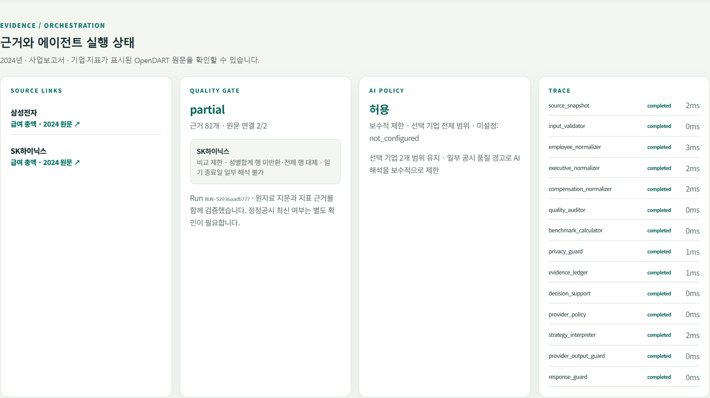
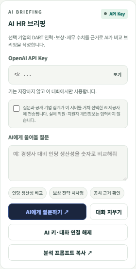

# DART HR Briefing

<p align="center"><a href="docs/assets/dart-hr-briefing-promo.mp4"></a></p>

<p align="center"><strong>▶ GIF 티저를 클릭하면 36.2초 Full HD 홍보영상이 열립니다.</strong> · <a href="docs/assets/dart-workforce-demo.mp4">26초 기능 시연</a> · <a href="docs/demo.html">브라우저용 플레이어</a></p>

**DART 기업 인력·보상 비교 브리핑 도구**

OpenDART의 기업 재무·직원·보상·임원 공시를 같은 기준연도와 보고서로 묶어 비교하고, **무엇을 판단할 수 있는지·무엇을 더 확인해야 하는지**를 근거와 함께 제시하는 People Analytics 프로그램입니다. AI는 사용자가 직접 실행하는 선택적 해석 보조이며, 결정 브리프와 수치는 AI 없이도 동일 입력에 동일 결과를 냅니다.

<p align="center"><strong>운영 앱:</strong> <a href="https://dart-ruby-zeta.vercel.app"><strong>https://dart-ruby-zeta.vercel.app</strong></a> · <a href="OpenDART_HR_Analytics_4시간_커리큘럼.md">4시간 실습 커리큘럼</a> · <a href="docs/HR_DECISION_SUPPORT.md">HR 판단지원 해설</a></p>

## 현재 배포 상태

| 항목 | 현재 상태 |
| --- | --- |
| 운영 URL | [`https://dart-ruby-zeta.vercel.app`](https://dart-ruby-zeta.vercel.app) |
| 상태 확인 URL | [`https://dart-ruby-zeta.vercel.app/api/health`](https://dart-ruby-zeta.vercel.app/api/health) |
| 합성 샘플 API | [`https://dart-ruby-zeta.vercel.app/api/classroom/bootstrap`](https://dart-ruby-zeta.vercel.app/api/classroom/bootstrap) |
| GitHub 저장소 | [`https://github.com/koul777/dart-hr-briefing`](https://github.com/koul777/dart-hr-briefing) |
| Vercel 상태 | **Ready** · production deployment `dpl_5QWXzizp2zobJ1neqpNFr7F15we7` |
| 운영 빌드 | v0.2.0 · [`git-78a9ae9932ee`](https://github.com/koul777/dart-hr-briefing/commit/78a9ae9932ee) · 2026-09-08 23:01 KST 재확인 |
| 릴리스 상태 | 질문 적합성·기업별 근거 귀속 및 `HEAD /` 연결 호환성 보강을 운영에 반영했습니다. `/api/health`의 `build_id`와 배포 대상 commit SHA를 대조해 검증합니다. |
| 데이터 | OpenDART 재무·직원·임원 공시, 기업 단위 집계 |
| AI | 사용자가 입력한 OpenAI API Key로 명시적 실행. 서버 소유 운영자 AI provider는 현재 비활성화 |
| 안전장치 | 질문 지표 적합성, 기업·수치·근거 귀속, 개인정보·인과·개인판단 출력 가드와 OpenDART 근거 대체 응답 |
| 검증 | Python 466건 회귀 통과 · 실제 Claude 모델 질문 3/3 통과 · production post-deploy smoke 통과 |
| 강의 자료 | 최종 편성 기준 16:9 총 60장(본문 42장·부록 18장). 원고·발표자 노트·자산 계약은 `training_deck/final_60/` 기준 |
| 홍보영상 | [`docs/assets/dart-hr-briefing-promo.mp4`](docs/assets/dart-hr-briefing-promo.mp4), 1920×1080·30fps·36.2초 |

운영 URL의 기능 여부는 문구만 믿지 않고 [`docs/PRODUCTION_RELEASE_CHECKLIST.md`](docs/PRODUCTION_RELEASE_CHECKLIST.md)의
`/api/health` 빌드 ID와 합성 bootstrap 계약으로 확인합니다. 릴리스 때마다 배포 대상 SHA를 전달한
post-deploy smoke가 root·정적 자산·소스 비공개·합성 데이터 계약을 함께 확인합니다.

### 운영 접속 검증 기록

2026-09-08 23:01 KST에 고정 운영 주소를 외부에서 다시 확인한 결과입니다. Vercel이 보여 주는
개별 deployment URL은 배포할 때마다 바뀔 수 있으므로 공유·북마크에는 위의
`https://dart-ruby-zeta.vercel.app`만 사용합니다.

| 검사 | 확인 결과 |
| --- | --- |
| `HEAD /` | HTTP 200, 응답 본문 0 byte, `Content-Length: 11404` |
| `GET /` | HTTP 200, `text/html; charset=utf-8`, 11,404 byte |
| `GET /api/health` | HTTP 200, `app.id=kr.opendart.dart-hr-briefing`, `build_id=git-78a9ae9932ee` |
| OpenDART | `api_key_configured: true` |
| strict schema | `strict_schema_enabled: true`, validator ready |
| 합성 수업 데이터 | `/api/classroom/bootstrap` 사용 가능, 외부 요청 0회 계약 |
| 배포 smoke | root·health·정적 자산·21개 보호 경로·합성 bootstrap 전체 통과 |

#### 2026-09-08 접속 장애 원인과 조치

- 앱의 `GET /`은 열렸지만 `HEAD /`이 501을 반환해 HEAD를 먼저 보내는 연결 확인 도구·일부
  클라이언트에서는 사이트가 연결되지 않는 것처럼 보일 수 있었습니다. 서버에 `do_HEAD`를 추가해
  GET과 같은 상태·헤더를 반환하되 본문은 보내지 않도록 수정했고, 회귀 테스트 2건을 추가했습니다.
- Git 연동 배포는 commit 작성자가 Vercel 프로젝트 배포 권한 사용자로 인식되지 않아 새 revision
  배포가 차단됐습니다. Git 메타데이터를 포함하지 않은 검증된 23개 런타임 allowlist 소스 번들을
  production에 배포하고 고정 alias를 갱신했습니다. 저장소의 이후 commit 작성자 설정도 GitHub
  계정과 일치하도록 바로잡았습니다.
- 수정 뒤 고정 운영 URL의 HEAD·GET·health와 post-deploy smoke를 모두 다시 실행했으며, 현재
  production은 Vercel `Ready`입니다.

### 이번 릴리스 변경사항

- **교육용 무네트워크 경로:** 첫 화면의 `합성 샘플로 시작`으로 두 가상 기업을 불러오며,
  실제 기업·개인정보·OpenDART·AI 호출 없이 전체 비교와 Strategy Brief를 실습할 수 있습니다.
- **HR Analytics 에이전트 강화:** 생산성·보상 지속가능성·인력구조·거버넌스·근거 완전성을
  3개 결정 브리프와 5개 readiness 차원으로 연결하고, 모든 수치에 evidence ID를 유지합니다.
- **AI 안전 경계 강화:** 개인정보, 근거 없는 수치·인과, 개인 평가, 채용·승진·보상·해고 같은
  자동 인사조치 권고를 일반 문장과 중첩 JSON 모두에서 검사하고, 차단 시 검증된 근거 대체 응답만 표시합니다.
- **AI 질문 정확성 검증:** 질문에서 요구한 지표와 실제 인용 지표가 같은 답변 구간에 있는지 확인하고,
  기업명과 `EV-…` 근거의 기업 귀속이 다르거나 질문과 무관한 답·모호한 비답변·분리된 형식적 인용이면
  원문을 폐기하고 검증된 근거 대체 응답으로 전환합니다.
- **실패 복구와 요청 예산:** OpenDART 재시도·fan-out·deadline을 제한하고, 기업·기간 변경 시
  진행 중인 비교와 AI 요청을 취소해 오래된 응답이 새 화면을 덮지 못하게 했습니다.
- **릴리스 보안:** Windows 실행 파일 preflight·strict smoke, Vercel function-first·default-deny
  업로드 목록, 배포 후 commit SHA·합성 계약·소스 비공개 검사, 비밀·대용량 파일 차단을 CI에 추가했습니다.
  로컬 전용 PPT 자산이 없는 clean checkout과 Windows·Linux 경로 차이도 구분해 검증합니다.
- **강의 운영 자료:** 4시간 실습 커리큘럼, 강사용·참가자용 런북, 실제 화면 중심 README와
  16:9 총 60장 강의 덱의 원고·발표자 노트·검증 계약을 정리했습니다.

`training_deck/`에는 원본 슬라이드 이미지와 생성 프롬프트까지 포함되어 용량이 크므로 Git과 Vercel
배포에서는 제외합니다. 최종 편성의 기준 원고는 `training_deck/final_60/outline.md`, 발표자 노트는
`training_deck/final_60/speech.md`, 구조 계약은 `training_deck/final_60/deck_spec.json`입니다. 조립된
PPTX는 로컬 산출물로 보존하며, 실제 수업 투입 전 [PPT 정렬 계획](docs/PPT_ALIGNMENT_PLAN.md)의 렌더·
증거 게이트를 통과해야 합니다.

### 강의 운영 불변식

- 수업은 **본문 42장**으로 4시간 골든패스를 운영하고 **부록 18장**은 질문·복구 때만 엽니다.
- 각 하드 체크포인트의 **정시 통과율이 80% 미만**이면 현재 작업을 보존하고 검증된 복구본으로
  전환합니다.
- 같은 OpenDART 요청은 **최초 요청 포함 최대 3회**, 즉 **재시도 최대 2회**에서 멈추고 합성
  샘플 또는 준비 화면으로 전환합니다.
- **사람의 역할**은 입력 범위 선택, 전송 동의, 공시 원문·근거 확인과 최종 판단 책임입니다.
  **AI의 역할**은 공개 기업 단위 집계의 근거 있는 요약·해석 초안이며 개인 평가·인과 단정·자동
  인사조치를 결정하거나 권고하지 않습니다.

## 홍보영상

[공식 홍보영상](docs/assets/dart-hr-briefing-promo.mp4)은 `video-shotcraft`의 Ink Press 10-shot 구조를 제품의 민트·딥그린 디자인 언어로 재구성했습니다. 실제 서비스 화면만 사용해 **기업 선택 → 동일 기준 비교 → Strategy Brief → 근거·품질 게이트 → AI 정책 검증** 흐름을 36.2초에 담았습니다. API 키·개인정보·비공개 데이터는 포함하지 않았으며 BGM 없이 라이선스가 확인된 Mixkit 효과음만 사용했습니다.

- Full HD MP4: [`docs/assets/dart-hr-briefing-promo.mp4`](docs/assets/dart-hr-briefing-promo.mp4)
- README 티저 GIF: [`docs/assets/dart-hr-briefing-promo.gif`](docs/assets/dart-hr-briefing-promo.gif) — 전체 영상을 2.5배속한 960×540 미리보기
- 엔딩 포스터: [`docs/assets/dart-hr-briefing-promo-poster.png`](docs/assets/dart-hr-briefing-promo-poster.png)
- 재현 가능한 Remotion 소스·실제 화면·오디오 출처: [`promo_video/`](promo_video/)

`promo_video/node_modules/`와 렌더 중간 산출물은 Git에서 제외하며,
`promo_video/` 전체와 `docs/` 미디어는 Vercel 함수 번들에서도 제외합니다.
따라서 영상 제작 의존성이 운영 배포 용량에 포함되지 않습니다.

별도의 [26초 기능 시연 영상](docs/assets/dart-workforce-demo.mp4)은 실제 앱을 headless Chrome으로 조작하고 자막·기능 라벨·가짜 커서·줌을 합성했습니다. 기업 선택부터 Strategy Brief의 Run ID·품질 게이트·공시 원문 링크 확인까지 실제 조작 흐름을 보여 줍니다.

## 핵심 기능

- 기업명·종목코드·DART 고유번호 검색 및 최대 8개 기업 비교
- 재무, 직원 수, 고용 형태, 평균 근속, 평균 급여, 임원구조 통합 조회
- Overview·Compare·Trend·People·Executives·Strategy Brief 시각화
- 생산성·보상 지속가능성·인력구조·거버넌스·근거 연결 완전성의 결정 준비도(`ready / directional_only / blocked`)
- 선택 기업 중앙값 위치·근거 ID·판단 한계·다음 판단 행동·다음 내부 데이터를 묶은 3개 결정 브리프
- `AI HR 브리핑` 카드에서 OpenAI API Key와 질문을 직접 입력하는 대화형 분석
- 사실·해석·가설·추가 검증 데이터·KPI를 구분하는 브리핑 규칙
- CSV 내보내기, Windows 단일 실행파일, Vercel 배포 구성 제공

## 시스템 사용 방법

아래 안내 이미지는 모두 실제 서비스 화면입니다. **이미지를 클릭하면 원본 크기로 확대**해 버튼 위치와 수치를 확인할 수 있습니다.

> **교육·예시 데이터 원칙:** 합성 fixture로 흐름을 먼저 확인하고, 실제 조회가 필요할 때는
> 삼성전자·SK하이닉스처럼 공개된 기업 단위 OpenDART 공시만 사용합니다. 실제 직원·지원자의
> 이름, 연락처, 이메일, 사번, 이력서, 평가·보상·건강·노조 정보는 프롬프트·소스·CSV·캡처에
> 입력하지 않습니다. 자세한 준비 절차는 [참가자 사전점검](docs/PARTICIPANT_PREFLIGHT.md)을
> 따릅니다.

### 1. 실행 방식 선택

| 상황 | 실행 방법 | 키 설정 |
| --- | --- | --- |
| 바로 체험 | [`https://dart-ruby-zeta.vercel.app`](https://dart-ruby-zeta.vercel.app) 접속 | OpenDART 키는 서버에 구성됨. AI를 쓸 때만 본인의 OpenAI 키 입력 |
| Windows 단일 실행 | `dist\DARTStructure.exe` 실행 후 표시된 로컬 주소 접속 | 최초 실행 전에 `OPENDART_API_KEY` 환경변수 설정 |
| 소스 개발 | `python server.py` 실행 후 `http://127.0.0.1:8765` 접속 | 프로젝트 루트 `.env` 사용 |

공개 URL과 로컬 실행 화면이 다르거나 다른 프로그램이 나타나면 먼저
`/api/health`를 확인합니다. 응답의 `app.id`가 `kr.opendart.dart-hr-briefing`이 아니면
현재 주소·포트를 다른 프로세스가 사용하고 있는 것입니다.

```powershell
Invoke-RestMethod https://dart-ruby-zeta.vercel.app/api/health
# 로컬 실행 확인
Invoke-RestMethod http://127.0.0.1:8765/api/health
```

<p align="center">
  <a href="docs/assets/classroom-sample-entry.png"></a>
  <br><sub><b>화면 1.</b> 왼쪽의 합성 샘플로 시작하거나, 상단 기준연도·보고서를 정한 뒤 공개 기업을 선택합니다.</sub>
</p>

### 2. 합성 샘플로 골든패스 확인

OpenDART 키나 네트워크 상태와 무관하게 교육 흐름을 먼저 검증하려면 첫 화면의
**합성 샘플로 시작**을 누릅니다.

1. 두 가상 기업과 2024년 사업보고서 fixture가 한 번에 로드됩니다.
2. 화면 위의 `SAMPLE — SYNTHETIC DATA` 배너와 `외부 호출 없음`(외부 OpenDART·AI 요청 0회)
   상태를 확인합니다.
3. Overview부터 Strategy Brief까지 탭을 둘러보고 **합성 결정 브리핑 만들기**를 실행합니다.
4. 샘플의 근거 ID는 교육용이며 DART 원문 링크를 제공하지 않습니다.
5. 실제 공시 조회로 전환할 때는 **실데이터 화면으로 돌아가기**를 누릅니다.

샘플 endpoint인 `GET /api/classroom/bootstrap`도 같은 fixture를 반환하며
`network_requests: 0`, `contains_real_company_data: false`,
`contains_personal_data: false` 계약을 유지합니다. `fixture_id`와 `provenance`에는
`source_data_used: false`, `third_party_content_used: false`가 함께 고정되어 실제 공시를
가공한 자료처럼 오인하거나 출처가 불명확한 샘플로 교체하는 회귀를 차단합니다.

<p align="center">
  <a href="docs/assets/classroom-sample-ui.png"></a>
  <br><sub><b>화면 2.</b> 합성 샘플은 두 가상 기업을 자동 선택하고 실제 데이터·개인정보·외부 API 호출이 없는 상태를 화면에 고정 표시합니다.</sub>
</p>

### 3. API 키 준비

- **OpenDART API Key** — 기업 검색과 공시 데이터 조회에 필요합니다. 공개 URL에서는 서버가 관리하고, 로컬에서는 `.env`의 `OPENDART_API_KEY`에 입력합니다.
- **OpenAI API Key** — AI HR 브리핑을 실행할 때만 선택적으로 필요합니다. 화면 왼쪽 입력란에 직접 넣으며 브라우저 저장소나 서버 파일에 저장하지 않습니다.
- `.env`, 실제 키, 개인·고객 데이터는 Git에 커밋하지 않습니다. `.env.example`에는 변수 이름만 유지합니다.

### 4. 기업 비교 실행

1. 화면 상단에서 **기준연도**와 **보고서**를 선택합니다.
2. 왼쪽 **기업 추가**에 기업명·종목코드·DART 고유번호를 입력합니다.
3. 검색 결과를 눌러 1개 이상, 최대 8개 기업을 비교 목록에 넣습니다. `×`를 누르면 제거됩니다.
4. 비교할 기업은 가능한 한 업종·규모·사업모델이 비슷하도록 구성합니다.
5. **인력·보상 비교**를 누릅니다. 재무·직원·임원·추이 데이터가 준비될 때까지 버튼의 로딩 상태를 기다립니다.
6. 상단 데이터 스트립에서 기준연도·보고서·수신 기업 수·근거 준비도·원문 연결 상태를 확인합니다.

<p align="center">
  <a href="promo_video/public/screens/companies-selected.png"></a>
  <br><sub><b>화면 3.</b> 비교 기업은 왼쪽 목록에서 확인합니다. 예시는 삼성전자와 SK하이닉스 2개 기업을 선택한 상태입니다.</sub>
</p>

> 기준연도, 보고서 또는 기업 목록을 바꾸면 이전 비교·Strategy Brief·AI 대화의
> 입력 조건이 달라집니다. 화면 안내에 따라 **인력·보상 비교**를 다시 실행하세요.

### 5. 분석 탭 읽기

| 탭 | 확인할 내용 | 해석할 때 주의할 점 |
| --- | --- | --- |
| Overview | 전년 대비 변화, 핵심 KPI, 자산·수익성 차트 | 변화가 인력·보상 때문에 발생했다고 단정하지 않음 |
| Compare | 기업별 재무지표 원값과 비율 | `데이터 없음`을 0으로 해석하지 않음 |
| Trend | 선택 지표의 연도별 흐름 | 보고서 종류와 공시 기준이 같은지 먼저 확인 |
| People | 직원 수·고용형태·근속·평균 급여·매출/인 | 공개 집계값이며 개인별 성과나 이직 원인을 포함하지 않음 |
| Executives | 임원·이사회 구조와 임기 | 승계 위험이나 조직문화를 자동 판정하지 않음 |
| Strategy Brief | 결정 브리프·이익 체력·People Signal·내부 진단 | readiness와 confidence를 확정 결론으로 사용하지 않음 |
| Radar | 여러 지표의 선택 집합 내 상대 위치 | 산업·규모 보정 외부 벤치마크가 아님 |
| Scatter | 두 지표의 상대적 분포 | 상관처럼 보여도 인과관계로 해석하지 않음 |
| Rank | 선택 지표의 비교 집합 내 순서 | 순위는 선택한 기업과 지표가 바뀌면 달라짐 |

`METRICS`의 지표 버튼을 눌러 차트·표의 표시 항목을 조정할 수 있습니다.
**초기화**는 기본 재무 지표 묶음으로 되돌립니다. `◐` 버튼은 밝은/어두운 테마를
전환하며 선택한 테마는 해당 브라우저에 저장됩니다.

<p align="center">
  <a href="promo_video/public/screens/tab-overview.png"></a>
  <br><sub><b>화면 4.</b> Overview에서는 전년 대비 변화, 핵심 KPI와 기업별 재무 규모를 먼저 훑습니다.</sub>
</p>

<p align="center">
  <a href="promo_video/public/screens/tab-compare.png"></a>
  <br><sub><b>화면 5.</b> Compare에서는 같은 공시 기준의 원값과 비율을 나란히 확인합니다.</sub>
</p>

### 6. Strategy Brief와 근거 확인

1. **Strategy Brief** 탭에서 생산성·보상 지속가능성·인력구조·리더십 연속성·근거 연결 완전성의 준비도를 확인합니다.
2. 각 Decision Brief의 대표지표, 선택 기업 중앙값 위치, confidence, 알 수 없는 것과 **다음 판단 행동**을 함께 읽습니다.
3. `SOURCE LINKS`에서 기업별 DART 원문을 열고 화면 수치와 기준연도·보고서를 대조합니다.
4. `QUALITY GATE`의 누락·비교 제한과 정정공시 최신성 미검증 경고를 확인합니다.
5. `TRACE`는 데이터 정규화, 품질 점검, 개인정보·근거·출력 가드의 실행 상태를 보여 줍니다.

<p align="center">
  <a href="promo_video/public/screens/tab-strategy.png"></a>
  <br><sub><b>화면 6.</b> Strategy Brief는 판단 신호와 한계, 다음 확인 행동을 한 카드에서 읽도록 구성했습니다.</sub>
</p>

<p align="center">
  <a href="promo_video/public/screens/strategy-evidence.png"></a>
  <br><sub><b>화면 7.</b> 아래쪽 근거 영역에서 DART 원문, 품질 게이트, AI 정책과 에이전트 실행 이력을 함께 검증합니다.</sub>
</p>

`ready`는 자동 의사결정 허가가 아니라 현재 비교 범위에서 근거 연결이 상대적으로
충분하다는 뜻입니다. 채용·보상·감축·평가·승계 조치를 정하려면 카드에 표시된
내부 HRIS·평가·보상 원장·설문 데이터를 별도로 확인해야 합니다.

### 7. AI HR 브리핑 사용

1. 기업 비교를 먼저 실행합니다.
2. 왼쪽 **OpenAI API Key**에 본인의 키를 입력합니다.
3. 예시 질문을 누르거나 최대 4,000자의 질문을 직접 작성합니다.
4. 질문과 공개 기업 집계가 선택한 AI 제공자에 전송된다는 안내를 읽고 **전송 동의**를 체크합니다.
5. **AI에게 질문하기**를 누르거나 입력창에서 `Ctrl+Enter`를 사용합니다.
6. 답변의 **확인된 사실·해석·가설·추가 검증 데이터·KPI**를 구분해 읽고, 근거 ID와 DART 원문을 대조합니다.
7. 같은 기업·연도·보고서에서는 후속 질문을 이어갈 수 있습니다. **대화 지우기**는 현재 대화만 초기화합니다.
8. **AI 키·대화 연결 해제**는 메모리의 키·연결 상태·대화·전송 동의를 모두 지웁니다.
9. **분석 프롬프트 복사**는 같은 구조의 근거 중심 질문을 다른 AI 도구에서 재사용할 때 씁니다.

<p align="center">
  <a href="docs/assets/ai-live-consent-disconnect.png"></a>
  <br><sub><b>화면 8.</b> 키와 질문을 입력하고 전송 범위를 확인해 동의합니다. 연결 해제는 키·대화·동의를 한 번에 지웁니다.</sub>
</p>

AI 출력이 개인정보·근거·인과·개인판단 검증을 통과하지 못하면 차단된 원문은
표시하지 않습니다. 대신 검증된 OpenDART 근거 요약을 보여 주므로 근거 ID와 원문을
확인한 뒤 질문을 “확인된 수치만”, “인과가 아닌 가설로”처럼 좁혀 다시 요청합니다.

### 8. 결과 저장과 공유

- **CSV 내보내기**는 비교를 실행한 뒤 사용할 수 있으며 기준연도·보고서·기업·전체 지표를 UTF-8 BOM CSV로 저장합니다.
- **프롬프트 복사**는 수치 자체가 아니라 현재 선택 조건과 근거 중심 분석 지시를 클립보드에 저장합니다.
- 보고서에 인용할 때는 화면 캡처만 붙이지 말고 기준연도·보고서·기업 집합·DART 원문 링크·데이터 한계를 함께 기록합니다.

### 9. 자주 발생하는 문제

| 증상 | 확인 및 해결 |
| --- | --- |
| 운영 URL이 연결되지 않음 | 고정 주소 [`https://dart-ruby-zeta.vercel.app`](https://dart-ruby-zeta.vercel.app)을 다시 열고 아래의 HEAD·health 명령을 확인. 둘 다 200이면 강력 새로고침(`Ctrl+F5`), 시크릿 창, 다른 네트워크 순서로 브라우저 캐시·DNS·프록시를 분리 점검 |
| DART HR Briefing이 아닌 다른 화면이 열림 | `/api/health`의 `app.id` 확인 → 다른 프로세스가 포트를 쓰면 종료하거나 이 서버를 다른 포트로 실행 |
| 기업 검색 실패 | OpenDART 키 설정, 네트워크, `/api/health`의 `api_key_configured` 확인 |
| 비교 버튼을 눌러도 진행되지 않음 | 기업을 1개 이상 선택했는지 확인. 연도·보고서 변경 후에는 비교를 다시 실행 |
| 일부 카드에 `데이터 없음` 표시 | 해당 공시 응답이 없거나 표준화할 수 없는 상태. 0으로 바꾸지 말고 원문·품질 경고 확인 |
| Strategy Brief가 `directional_only` 또는 `blocked` | 비교 기업 수, 대표지표 표본, 근거 연결과 누락 항목을 확인하고 비교 집합 또는 내부 데이터를 보완 |
| AI 실행 실패 | OpenAI 키·계정 한도·네트워크를 확인. 결정 브리프와 일반 비교 기능은 AI 없이 계속 사용 가능 |
| AI 검증 정책 차단 | 화면의 안전한 근거 대체 응답과 차단 항목을 확인한 뒤 질문 범위를 좁힘 |
| CSV 버튼이 작동하지 않음 | 기업 비교를 먼저 실행하고 브라우저 다운로드 권한 확인 |

```powershell
curl.exe -I https://dart-ruby-zeta.vercel.app/
Invoke-RestMethod https://dart-ruby-zeta.vercel.app/api/health
```

첫 명령은 `HTTP/1.1 200`, 두 번째 명령은 `ok: true`와
`app.id: kr.opendart.dart-hr-briefing`을 반환해야 합니다. `/api/health`의
`ai_provider_configured: false`만으로는 접속 장애가 아닙니다. 이 값은 서버 소유 운영자 AI provider가
비활성화됐다는 뜻이며, DART 비교·Strategy Brief와 사용자가 자신의 OpenAI 키로 실행하는 경로는
별도입니다.

## 3분 빠른 시작

1. Windows에서는 저장소에 포함된 검증 실행 파일 `dist\\DARTStructure.exe`를,
   개발 환경에서는 `python server.py`를 실행합니다.
2. **합성 샘플로 시작**을 눌러 두 가상 기업, SAMPLE 배너와 외부 호출 0회 흐름을 확인합니다.
3. 실데이터가 필요하면 OpenDART 인증키를 `.env`의 `OPENDART_API_KEY`에 입력하고 앱을 재시작합니다.
4. 기업과 기준연도·보고서를 선택하고 **인력·보상 비교**를 누릅니다.
5. **Strategy Brief**에서 결정 브리프·품질 게이트·원문 링크를 먼저 확인합니다.
6. 추가 해석이 필요할 때만 본인의 OpenAI API Key와 질문을 입력하고 전송 동의 후 **AI에게 질문하기**를 누릅니다.

> 실제 인증키가 들어 있는 `.env`는 Git에서 제외됩니다. OpenAI 키도 저장소나 `localStorage`에 저장하지 않습니다.

## 이 프로그램으로 무엇을 보나요?

이 프로그램은 사내 HRIS를 대체하거나 개인별 성과를 판정하는 도구가 아닙니다. 공개 공시의 집계값을 기업 단위로 비교해 다음 질문의 출발점을 제공합니다.

> 레이더·산점도·순위를 포함한 모든 기업 비교는 선택 집합 안의 상대 관찰입니다. 인과관계, 개인평가, 자동 채용·보상·감축·승계 조치의 근거로 사용하지 않습니다.

- 이익 체력과 평균 급여·인당 지표는 어떤 관계를 보이는가?
- 직원 수, 정규직 비중, 평균 근속, 평균 급여가 기업별로 어떻게 다른가?
- 등기·미등기 임원, 상근·비상근, 임기 만료 구조는 어떻게 구성되어 있는가?
- 성별 급여·근속 집계가 공시된 경우, 어떤 차이가 확인되며 무엇이 아직 검증되지 않았는가?
- 공시 수치로 세운 HR 전략 가설을 어떤 내부 데이터와 KPI로 추가 검증해야 하는가?

## 화면 구성

### 1. 기업 선택과 비교 기준

기업명·종목코드·DART 고유번호로 기업을 검색하고, 기준연도와 보고서 종류를 맞춘 뒤 비교를 실행합니다. 같은 기준으로 선택 기업을 조회하기 때문에 기업 간 숫자의 출처와 기준을 추적하기 쉽습니다.


### 2. 시각화 중심의 분석 탭

| 탭 | 핵심 시각화 | HR 전략에서의 활용 |
| --- | --- | --- |
| Overview | 전년 변화 요약·탭별 HR readout·핵심 KPI | 무엇이 달라졌는지와 비교 범위 우선 파악 |
| Compare | 재무 구조 비교 카드·테이블 | 이익·부채·현금·자본의 차이 확인 |
| Trend | 연도별 선 그래프와 수치 표 | 최근 방향성과 구조 변화 탐색 |
| People | 직원 수·정규직·근속·급여 카드 | Workforce 규모와 보상 수준 비교 |
| Executives | 임원 구성·직위·등기·상근 현황 | 거버넌스와 리더십 구조 확인 |
| Strategy Brief | 이익 체력·People Signal·보상 검증 프레임 | HR 전략 가설과 추가 검증 과제 도출 |
| Radar / Scatter / Rank | 상대 레이더·산점·순위 시각화 | 여러 지표의 패턴과 이상치 탐색 |

### 3. Strategy Brief의 시각화 계층

참고 대시보드 `기업 비교 대시보드_v1.html`의 시각 언어와 정보 흐름을 반영해, Strategy Brief는 숫자를 한 번에 결론 내리기보다 실제 공시와 모델 추정을 층별로 분리합니다.

1. **Decision Brief** — 생산성·보상 지속가능성·인력구조 질문별로 대표지표 선정 이유, 비교 위치, 근거, 신뢰 수준, 알 수 없는 것, 다음 판단 행동과 내부 데이터를 함께 보여줍니다. 선택 기업이 4개 미만이면 `ready`로 표시하지 않으며, 중앙값 위치는 산업·규모·사업모델을 보정한 외부 벤치마크가 아닙니다.
2. **Profit Capacity** — 영업이익, 영업이익률, 인당 영업이익, 평균 급여와 계산 근거를 기업 카드로 비교합니다.
3. **Operating Profit** — 기업별 연도 영업이익 막대 그래프를 그리고, 다음연도 값은 해칭으로 구분합니다.
4. **Average Pay** — 평균 급여 연도별 SVG 라인 차트와 다음연도 전망 구간을 표시합니다.
5. **Pay Equity** — 성별 급여 비율·근속 차이·분석 표본을 공시된 경우에만 보여줍니다.
6. **Internal Diagnostics** — 평가·보상 원장·설문 등 질문별로 필요한 내부 데이터와 확인 목적을 구체적으로 표시합니다.
7. **Evidence / Orchestration** — 기업·지표별 DART 원문 링크, 데이터 공백 분류, 품질 게이트, 에이전트 trace를 한 화면에서 확인합니다.

`E` 또는 해칭으로 표시된 값은 DART 확정 공시값이 아니라 최근 공개 추세를 화면에서 단순 연장한 모델 추정입니다. 투자·인사 의사결정용 확정 예측으로 사용하지 않습니다.

## AI HR 브리핑은 무엇인가요?

사이드바의 **AI HR 브리핑**은 현재 선택 기업의 DART 재무 수치와 People Analytics 집계값에 사용자의 질문을 결합하는 대화형 기능입니다. 예를 들면 다음과 같이 입력할 수 있습니다.

> 영업이익 증가와 평균 급여 변화가 함께 나타나는 기업과 그렇지 않은 기업을 구분하고, HR 전략 가설·추가 검증 데이터·KPI를 제안해줘.

실행 시 프로그램은 다음 정보를 포함한 분석 프롬프트를 구성합니다.

- 기준연도·보고서 코드와 기업별 재무 수치
- 직원 수, 정규직·계약직, 평균 근속, 평균 급여, 임원 공시
- 사용자가 입력한 질문
- 공시 누락·회계정책 차이·집계값의 한계를 구분하라는 해석 규칙

화면 왼쪽의 **AI HR 브리핑** 카드에 사용자의 OpenAI API Key와 질문을 입력하고
전송 안내에 명시적으로 동의한 뒤 **AI에게 질문하기**를 누르면 OpenAI Responses API가 한국어 HR 브리핑을 생성합니다.
키는 브라우저 저장소나 서버 설정에 저장하지 않고 AI 생성 요청의 헤더로만 전달됩니다.
브라우저 탭을 새로 열거나 새로고침하면 키를 다시 입력해야 합니다. AI는 DART
원자료를 대체하지 않으며 provider 오류를 성공 결과로 표시하지 않습니다.

### “AI 응답이 검증 정책을 통과하지 못했습니다”가 표시될 때

이 상태는 API 연결 실패가 아니라 생성된 초안이 개인정보·근거·인과·개인판단 검증에서 차단됐다는 뜻입니다. 현재 버전은 차단된 AI 원문을 폐기하고 다음의 안전한 대체 응답을 표시합니다.

- 서버 evidence ledger에서 형식과 공식 DART 원문 링크가 확인된 근거만 선택
- 기업명·지표·값과 `EV-…` 근거 ID를 함께 표시
- 질문이 요구한 지표가 같은 답변 구간에서 직접 다뤄졌는지 확인
- 각 기업명·수치 바로 뒤의 `EV-…`가 실제로 같은 기업의 근거인지 확인
- 질문과 무관한 근거, 모호한 비답변, 문맥에서 분리된 형식적 인용을 차단
- 차단 사유를 사용자 친화적인 검증 항목으로 설명
- 기업 공시 비교는 인과관계나 개인의 성과·채용·평가 판단이 아니라는 해석 한계 유지
- 안전하게 표시할 근거가 없으면 수치나 결론을 새로 만들지 않고 명시적으로 중단

따라서 같은 질문을 무조건 재시도하기보다, 화면에 표시된 근거 ID와 원문을 확인하고 “확인된 수치만 비교해줘”, “인과가 아니라 가설과 추가 검증 데이터로 구분해줘”처럼 질문 범위를 좁히는 것이 좋습니다.

### Evidence-first Agent Orchestration v2

단일 연도 AI 분석은 `source_snapshot → input_validator → 병렬 normalizer →
quality_auditor → benchmark_calculator → privacy_guard → evidence_ledger →
decision_support → provider_policy → strategy_interpreter → provider_output_guard → response_guard` 순서로
실행됩니다.

- 각 지표는 결정적인 `EV-…` ID, 원천 컴포넌트, 접수번호, 원자료 지문을 갖습니다.
- `decision_support`는 비교 가능한 근거 수와 관련 품질만으로 판단 준비도·선택 기업 중앙값 차이·다음 판단 행동·다음 내부 데이터를 결정론적으로 만듭니다. 모든 후보 지표가 비교 가능해도 대표지표 표본이 4개 미만이면 최대 `directional_only`입니다.
- AI provider에는 정책상 제외 관측치가 없을 때 이 결정지원 계층을 `available`로 전달합니다. 제외 관측치가 하나라도 있으면 허용 관측치만으로 다시 계산한 브리프를 `limited`로 전달해, 안전장치는 유지하면서 화면의 전체 브리프와 AI의 실제 근거 범위를 혼동하지 않게 합니다.
- `policy.mode=limited`는 부분 품질만으로도 설정될 수 있습니다. 이때 제외 기업이 0개이면 `decision_support_status=available`과 함께 선택 기업 전체 범위를 유지하며, 화면은 이를 “보수적 제한”으로 풀어 표시합니다. 실제 제외가 있을 때만 허용 기업 범위로 브리프를 다시 계산합니다.
- 각 지표는 후행 지표, 조기점검 대리 지표, 벤치마크, 데이터 공백으로 구분하고 해석 한계를 함께 제공합니다.
- 재무·직원·임원·미등기임원 보수의 출처를 컴포넌트별로 분리합니다.
- 파생 지표는 필요한 모든 원천 컴포넌트의 접수번호가 있을 때만 AI 컨텍스트에 포함합니다.
- `provider_output_guard`는 질문의 명시적 지표와 인용 지표의 문맥 일치, 기업명과 근거 원장의 기업 귀속을
  함께 검사합니다. `orchestration_evaluation`도 같은 규칙을 독립적으로 재검증해 사후 변조를 차단합니다.
- 한 단계가 실패하면 의존 단계가 `blocked`로 trace에 남고 AI 호출은 진행하지 않습니다.
- 개인정보, 허용되지 않은 evidence ID, 근거 없는 숫자, 인용 값과 모순되는 숫자, 근거 없는 인과 단정, 가공 인물에 대한 개인 판단이 AI
  출력에 있으면 provider 결과를 `rejected`로 폐기합니다.
- 비표준 JSON 수치, 안전하지 않은 유니코드 제어문자, 256KiB를 넘는 AI 출력도 폐기합니다.
- 연도 범위 AI 생성은 기간 evidence 계약이 준비될 때까지 fail-closed로 비활성화합니다.
- v2 응답은 기본값으로 번들 JSON Schema와 결정지원 근거 참조 무결성을 모두 검증합니다.
- 정정공시 최신성 미검증 경고는 결정 브리프와 readiness matrix보다 먼저 노출해 `ready`를 확정 판단으로 오해하지 않게 합니다.

응답 계약은 [`schemas/workforce_orchestration_v2.schema.json`](schemas/workforce_orchestration_v2.schema.json),
오프라인 평가기는 [`orchestration_evaluation.py`](orchestration_evaluation.py), 실행 흐름은
[`orchestration-dart-claude.html`](orchestration-dart-claude.html)에서 확인할 수 있습니다.
HR 사용자가 readiness·confidence·선택 cohort·금지 용도를 해석하는 기준은
[`docs/HR_DECISION_SUPPORT.md`](docs/HR_DECISION_SUPPORT.md)에 정리했습니다.

## 공개 URL(Vercel)에서 사용하는 방법

웹 배포형은 다음 흐름을 기준으로 사용합니다.

운영 주소는 [`https://dart-ruby-zeta.vercel.app`](https://dart-ruby-zeta.vercel.app)이고, 상태 확인 주소는
[`https://dart-ruby-zeta.vercel.app/api/health`](https://dart-ruby-zeta.vercel.app/api/health)입니다.
health 응답에서 앱 ID, OpenDART 키 구성 여부, strict schema 상태와 배포 빌드 ID를 확인할 수 있습니다.

1. 운영자가 Vercel 서버 환경변수에 `OPENDART_API_KEY`를 설정합니다. 이 키는 브라우저에 노출하거나 저장소에 커밋하지 않습니다.
2. 사용자가 Vercel URL에 접속합니다.
3. 기업명·종목코드·DART 고유번호로 기업을 검색하고, 기준연도와 보고서를 선택한 뒤 **인력·보상 비교**를 실행합니다.
4. `Overview`, `People`, `Executives`, `Strategy Brief` 탭에서 재무·인력·임원구조 시각화를 확인합니다.
5. 왼쪽 **AI HR 브리핑** 카드에 본인의 `OpenAI API Key`와 질문을 입력하고 전송 안내에 동의한 뒤 **AI에게 질문하기**를 누릅니다.
6. 첫 답변 뒤에 질문을 계속 입력하면 최근 대화와 같은 기업·연도의 DART 근거를 이어서 전달합니다.

OpenDART 인증키는 Vercel 서버 환경변수에서 읽습니다. 사용자가 입력한 OpenAI 키는
해당 브라우저 탭의 메모리에만 유지되고 서버에는 저장되지 않습니다. OpenAI 키가
없어도 DART 기반 비교·People·Executives·Strategy Brief 시각화는 사용할 수 있고
AI 자동 해석만 제한됩니다.

현재 production health의 `ai_provider_configured`는 `false`, `operator_ai_access.enabled`는
`false`입니다. 이는 서버 소유 Claude MCP/운영자 자동화 provider를 익명 사용자가 호출할 수 없다는
뜻입니다. 사용자가 AI 카드에 직접 넣는 OpenAI 키는 요청 헤더로 전달되어 별도의 요청별 provider를
만들며, 서버 설정이나 브라우저 저장소에 보관되지 않습니다. 운영 확인 과정에서는 실제 사용자 키를
사용하거나 저장하지 않았으므로, production의 유료 AI 호출 성공을 health 결과만으로 주장하지 않습니다.

> 공개 서비스에서는 DART 호출량 제한, 사용자별 요청 제한, API 키 미노출 정책을 함께 적용해야 합니다. 인증키를 query string이나 프론트엔드 코드에 포함하지 않습니다.

현재 내장 캐시와 요청 제한은 프로세스 단위입니다. 로컬 실행과 단일 장기 실행 프로세스에는
유효하지만, Vercel처럼 여러 인스턴스가 생성되는 serverless 환경에서는 인스턴스 전체의
분산 한도를 보장하지 않습니다. 공개 운영 전에는 외부 KV/Redis/API gateway 기반 분산
rate limit과 비용 한도를 별도로 적용해야 합니다. Strategy 탭 조회는 AI provider를 호출하지
않으며, 유료 AI 호출은 사용자가 `AI에게 질문하기`를 명시적으로 누른 POST 요청에서만 발생합니다.

한 HTTP 요청이 만드는 OpenDART fan-out은 기본 35초·실제 네트워크 시도 48회의 공유 예산을
사용합니다. 개별 시도는 최대 10초이고 최초 호출 포함 최대 3회(재시도 최대 2회)이며, 캐시 hit는 시도 예산을 쓰지
않습니다. 예산을 넘으면 완료된 기업·연도는 유지하고 나머지는 “범위를 줄이고 다시 시도”할 수
있는 부분 결과로 반환합니다. 이 요청별 예산은 분산 일·월 비용 한도를 대체하지 않습니다.

배포 준비 파일인 `api/index.py`, `vercel.json`, `.python-version`, `uv.lock`이 포함되어
있습니다. GitHub 저장소를 Vercel 프로젝트에 연결한 뒤 `OPENDART_API_KEY`와
`OPENAI_MODEL`을 서버 환경변수로 등록하면 동일한 앱을 배포할 수 있습니다.
일반 사용자는 AI HR 브리핑 카드에 자신의 키와 질문을 직접 입력합니다. 서버 소유
`OPENAI_API_KEY`를 운영자 자동화에 사용할 때는 `DART_ALLOW_OPERATOR_AI_PROVIDER=true`와
32자 이상의 `DART_OPERATOR_AI_TOKEN`을 함께 설정해야 하며, 자동화 요청도 일치하는
`X-DART-Operator-Token` 헤더와 `provider_data_consent: true`를 보내야 합니다. 이 경계를
설정하지 않은 익명 요청은 서버 소유 AI 키를 사용할 수 없습니다.

운영 키는 `.env` 파일을 업로드하지 말고 Vercel의 암호화된 환경변수로 등록합니다.

```powershell
python -X utf8 tools/repository_size_contract.py --root .
python -X utf8 tools/release_secret_scan.py --root .
# Windows EXE 릴리스도 함께 만들었다면 소스보다 새 빌드인지 검사
python -X utf8 tools/release_preflight.py --root . --exe dist/DARTStructure.exe
vercel env add OPENDART_API_KEY production --sensitive
vercel deploy --prod
```

첫 명령은 Git 추적 파일과 무시되지 않은 신규 파일을 함께 검사합니다. 단일 파일 50MiB,
전체 후보 100MiB를 넘거나 `reports/*/`, `training_deck/`, `video_work/`, 가상환경·캐시·
`node_modules` 같은 생성 디렉터리가 후보에 들어오면 실패합니다. 현재 로컬 `reports/`에는
Windows·Vercel 격리 빌드가 누적되어 1GB를 넘을 수 있지만 `.gitignore`로 제외되며, `git add -f`
또는 광범위한 강제 추가를 사용하지 않습니다. 최종 커밋 전에는 명시 경로만 stage한 뒤 이 용량
계약과 비밀정보 검사를 다시 실행합니다.

`.vercelignore`는 기본 차단 후 런타임과 잠금 재현에 필요한 파일만 허용하며, `vercel.json`의 함수 제외 규칙도 PPT·보고서·영상·테스트·로컬 빌드 산출물을 배포에서 차단합니다. 현재 working tree 기준 Vercel 후보는 23개·약 2.49MiB이고, 단일 후보는 2MiB·전체 후보는 6MiB를 넘지 않도록 계약 테스트가 막습니다. 저장소 정책상 `vercel deploy --prebuilt`는 금지합니다. 로컬 `.vercel/output`은 이전 코드·환경을 포함할 수 있는 캐시일 뿐 릴리스 입력이 아니므로, Vercel이 allowlist 소스와 `uv.lock`에서 새로 빌드하는 표준 배포만 사용합니다.

배포 후에는 배포 대상 commit SHA를 전달해 root·health·합성 교실 계약, `api_key_configured: true`, 정확한 `build_id`를 자동 검증합니다. Vercel에서는 임의의 `DART_BUILD_ID`보다 `VERCEL_GIT_COMMIT_SHA`가 우선하므로, 다른 commit의 오래된 배포는 이 검사에서 통과하지 못합니다.

```powershell
python -m unittest -v test_deployment_artifact_contract
python -X utf8 tools/post_deploy_smoke.py `
  --base-url https://dart-ruby-zeta.vercel.app `
  --expected-sha <배포한 Git commit SHA>
```

## 데이터 범위

현재 프로그램은 기업 근거 데이터에 공개 OpenDART API를 사용하고, 선택적으로 OpenAI Responses API를 이용해 브리핑을 생성합니다.

- 재무 단일회사 공시: `fnlttSinglAcnt.json`
- 직원 현황: `empSttus.json`
- 임원 현황: `exctvSttus.json`
- 미등기 임원 보수: `unrstExctvMendngSttus.json`
- 연도별 재무·People·임원 이력 API
- 임원별 이름·생년월·경력 등은 통계 목적의 기본 화면에 불필요하게 노출하지 않고 집계 중심으로 다룹니다.

## 실행 방법

### 가장 빠른 실행

Windows 검증 실행 파일을 실행합니다. 공개 저장소를 새로 clone한 환경에서도 아래 경로를
그대로 사용할 수 있습니다.

```powershell
$env:OPENDART_API_KEY = "발급받은 OpenDART 인증키"
.\dist\DARTStructure.exe
```

프로그램은 기본적으로 `http://127.0.0.1:8765`에서 실행됩니다. 다른 프로그램이 이 포트를
사용 중이면 중복 바인딩하지 않고 다음 빈 로컬 포트를 선택하며, 방금 시작한 DART 인스턴스의
앱 ID·버전·빌드 ID를 확인한 뒤 그 주소만 브라우저에서 엽니다. `PORT` 환경변수를 명시한
자동화 환경에서는 지정 포트를 사용할 수 없을 때 다른 포트로 이동하지 않고 명확히 실패합니다.
실행 전 `OPENDART_API_KEY` 프로세스 환경변수를 설정하거나 실행 파일의 `dist` 폴더에 `.env`를 둡니다.
실행파일은 실행파일이 있는 폴더의 `.env`만 신뢰합니다. 폴더명이 정확히 `dist`이고
상위에 `DARTStructure.spec`이 있는 표준 소스 배치에서는 호환성을 위해 상위 프로젝트의 `.env`도 확인하지만, 임의의 현재 작업
폴더 `.env`는 읽지 않습니다. 동일 키의 프로세스 환경변수는 `.env`보다 우선합니다.
화면 왼쪽 아래와 `/api/health`에서 현재 버전·빌드 ID·실제 포트를 확인할 수 있습니다.

### 개발 모드

Python 3.11 이상을 권장합니다.

```powershell
python -m pip install --upgrade "pip>=26.2.1,<27"
python -m pip install "uv==0.11.2"
uv sync --locked --extra dev
Copy-Item .env.example .env
# .env의 OPENDART_API_KEY에 OpenDART 인증키 입력
uv run --locked --extra dev python server.py
```

위 명령은 `uv.lock`에 고정된 개발·품질 의존성을 준비합니다. CI 매트릭스도 같은 잠금파일을 Python 3.11–3.14에서 검증하며, 설치된 패키지 취약점 감사까지 통과해야 합니다. Windows 배포 실행에는 별도 Python 설치가 필요하지 않습니다.

`.env`에는 OpenDART 키를 필수로 넣습니다. AI 브리핑 키는 실행 후 왼쪽 입력란에
직접 넣는 방식이 기본입니다. 자동화 호출에서 서버 소유 OpenAI 키를 쓰려면
`DART_ALLOW_OPERATOR_AI_PROVIDER`, `DART_OPERATOR_AI_TOKEN`과 요청 헤더를 함께 구성해야
합니다. 별도 Claude MCP gateway가 있는 환경에서는 기존 gateway 설정을 대체 경로로
사용할 수 있습니다.

```text
OPENDART_API_KEY=
OPENAI_API_KEY=
OPENAI_MODEL=gpt-5.6-luna
OPENAI_TIMEOUT_SECONDS=60
OPENAI_MAX_OUTPUT_TOKENS=1800
DART_CACHE_TTL_SECONDS=300
DART_CACHE_MAX_ENTRIES=512
DART_CACHE_MAX_BYTES=67108864
DART_DATA_DIR=
DART_RETRY_ATTEMPTS=3
DART_RETRY_BASE_DELAY_MS=250
DART_RATE_LIMIT_PER_MINUTE=30
DART_RATE_LIMIT_MAX_CLIENTS=4096
DART_OPEN_BROWSER=true
DART_STRICT_ORCHESTRATION_SCHEMA=true
CLAUDE_MCP_GATEWAY_URL=
CLAUDE_MCP_GATEWAY_TOKEN=
CLAUDE_MCP_GATEWAY_TIMEOUT_SECONDS=20
```

`DART_DATA_DIR`가 비어 있으면 소스 실행은 프로젝트 `data`, frozen 실행은
`%LOCALAPPDATA%\DART-HR-Briefing`, Vercel은 `/tmp/dart-workforce`를 사용합니다.

비교 조회 API는 단일 `corp_code`가 아니라 `corp_codes` 계약을 사용합니다.
GET `/api/financials`, `/api/people`, `/api/people/history`, `/api/workforce/orchestration`는
쉼표로 구분한 `corp_codes` 쿼리 문자열을 받고, POST `/api/analysis`,
`/api/analysis/context`는 JSON 배열 또는 문자열 `corp_codes`를 받습니다.

AI HR 브리핑 카드에 OpenAI 키를 입력하고 전송 안내에 동의하면 AI 분석 질문과 Strategy Brief에서 OpenDART
수치와 출처만을 근거로 한국어 HR 브리핑을 생성합니다. 사용자가 입력한 키는
서버 응답, 로그, 저장소, `localStorage`에 포함하지 않습니다.
`OPENAI_MODEL`은 계정에서 사용할 수 있는 Responses API 모델로 바꿀 수 있습니다.
사용자 키가 없고 승인된 운영자 토큰도 없으면 서버 소유 OpenAI 키는 사용하지 않으며,
근거 기반 비교·Strategy Brief·프롬프트 복사는 계속 사용할 수 있습니다.

AI 브리핑의 항목과 판단 원칙은 [`HR_BRIEFING_RULES.md`](HR_BRIEFING_RULES.md)에
분리되어 있습니다. 교육 실습에서는 이 파일을 수정해 브리핑 구조와 추가
검증 KPI가 어떻게 달라지는지 확인할 수 있습니다.

인증키와 gateway token은 저장소에 커밋하지 않습니다. `.env.example`만 공유용으로 포함합니다.

## 품질 확인

현재 구현 상태에서 다음 검증을 통과했습니다.

```powershell
python -m unittest discover -v
python -m coverage run -m unittest discover
python -m coverage report -m
python -m ruff check . --select E4,E7,E9,F
python -m py_compile analysis_contract.py server.py agent_orchestration.py classroom_mode.py workforce_analytics.py claude_mcp_adapter.py openai_responses_adapter.py orchestration_evaluation.py orchestrator.py runtime_controls.py tools/benchmark_orchestration.py tools/artifact_manifest.py tools/classroom_preflight.py tools/post_deploy_smoke.py tools/release_preflight.py tools/release_secret_scan.py tools/repository_size_contract.py tools/vercel_bundle_contract.py
node --check static/app.js
node --check tools/qa_classroom_mode.js
node --check tools/qa_failure_recovery.js
node --check tools/qa_orchestration_v2.js
python tools/benchmark_orchestration.py --iterations 100 --warmups 5
```

현재 Python 3.12 전체 466건 회귀와 제품 모듈 branch coverage 86%, 핵심 v2 DAG 93%를
기준으로 관리합니다. `jsonschema`는 핵심 런타임 의존성이며 소스·패키지 모두 strict schema를
기본으로 검증합니다. 지원 Python 버전별 CI도 같은 전체 계약을 실행해야 합니다. 테스트 개수는
구현에 따라 달라질 수 있으므로 성공 여부는 명령의 종료 코드와 실패 내역으로 판단합니다.
2026-09-08에는 테스트 전용 `StrategyProvider` 어댑터로 실제 Claude 모델을 호출해
직원 1인당 매출 비교, 평균 급여 비교, 급여와 영업이익의 인과 한계 질문을 E2E로 재검증했으며
3문항 모두 질문 적합성·수치 일치·기업별 근거 귀속·인과 제한 검사를 통과했습니다.
이는 로컬 실제 모델 검증 결과이며 위 운영 URL의 AI provider 배포 완료를 뜻하지 않습니다.

| 실제 모델 질문 유형 | 확인한 핵심 계약 | 결과 |
| --- | --- | --- |
| 두 기업 중 직원 1인당 매출이 더 높은 기업 | 질문 지표를 직접 답하고 해당 기업의 값·`EV-…` 근거를 같은 답변 구간에 귀속 | 통과 |
| 두 기업 중 평균 급여가 더 높은 기업 | 매출 등 다른 지표로 바꾸지 않고 평균 급여 값과 기업별 근거를 일치 | 통과 |
| 평균 급여 변화와 영업이익 변화의 관계 | 공시의 동시 변화만으로 인과를 단정하지 않고 가설·추가 검증 데이터로 제한 | 통과 |

이 검증은 “모델이 문장을 생성했다”만 확인한 것이 아닙니다. 질문과 답변 지표의 문맥 일치,
숫자와 evidence ledger 값의 일치, 기업명과 evidence ID의 소유 기업 일치, 근거 없는 인과·개인판단·
자동 인사조치 권고 부재를 런타임 guard와 독립 평가기로 각각 검사했습니다. 실패하는 원문은 사용자에게
그대로 노출하지 않고 검증된 근거 대체 응답으로 전환합니다.
격리 PyInstaller smoke에서는 `tools/packaged_runtime_smoke.py`로 strict schema를 켠 실제 OpenDART schema v2 응답과 evidence 41/41건 원문 연결을
확인했고, headless Edge에서는 공식 citation 링크와 unsafe URL 비링크를 비롯해 원자적 비교 커밋,
기간 변경 시 AI 취소, 숫자 경계, CSV 수식 주입 방어를 검증했습니다.
상세 기록은 [`reports/ai_agent_orchestration_v2_20260830.md`](reports/ai_agent_orchestration_v2_20260830.md)에 있습니다.

## 시연 영상 제작

시연 영상은 [demo-video-skill](https://github.com/Kminer2053/demo-video-skill)을 Codex 스킬 디렉터리에 실제 설치한 뒤, 설치본의 고정 절차를 적용해 제작했습니다. 실제 앱을 Playwright headless 브라우저로 조작하면서 다음 흐름을 녹화합니다.

1. 기업 검색·선택
2. 삼성전자·SK하이닉스 DART 비교
3. Strategy Brief의 DART 실제값·모델 추정 구분
4. Run ID·품질 게이트·공시 원문 링크·에이전트 TRACE 확인

재현하려면 개발 서버를 먼저 실행한 뒤, Node.js·`playwright-core`·Chrome·`ffmpeg`가 준비된 환경에서 대표 씬 `3`을 캡처합니다. 캡처기는 비교 조회 대기 구간의 시작·종료 시점을 JSON으로 출력하므로 그 구간만 6배속 처리할 수 있습니다.

```powershell
$env:APP = "http://127.0.0.1:8765"
$env:SCR = "C:\workspace\dart\video_work"
$env:CHROME_PATH = "C:\Program Files\Google\Chrome\Application\chrome.exe"
$env:PLAYWRIGHT_CORE = "C:\workspace\dart\video_work\node_modules\playwright-core"
node tools/capture_dart_demo.js 3
```

녹화 원본과 3×3 몽타주·스팟 프레임은 `video_work/`에 두며 저장소에는 포함하지 않습니다. 대기 구간 압축 후 몽타주 육안검사와 5개 시점 스팟검사를 통과한 최종 MP4·GIF만 `docs/assets/`에 저장합니다. 실제 재생을 확인한 뒤 자막이나 줌 위치를 수정해야 한다면 씬 `3`만 다시 렌더하면 됩니다.

### 영상이 README에서 바로 재생되지 않을 때

GitHub README는 MP4를 일반적인 `<video>` 플레이어로 자동 재생하지 않을 수 있습니다. GIF는 README에서 바로 보이고, 전체 영상은 [MP4 원본](docs/assets/dart-workforce-demo.mp4)을 열거나 [`docs/demo.html`](docs/demo.html)을 내려받아 브라우저로 열면 재생됩니다.

```powershell
python -m http.server --directory docs 8000
# 브라우저에서 http://127.0.0.1:8000/demo.html 접속
```

## 문서

- [`OpenDART_HR_Analytics_4시간_커리큘럼.md`](OpenDART_HR_Analytics_4시간_커리큘럼.md) — 2026년 9월 30일 WEEK 2, 4시간 실습형 강의 구성
- [`docs/PARTICIPANT_PREFLIGHT.md`](docs/PARTICIPANT_PREFLIGHT.md) — 참가자 계정·환경·보안 사전점검과 복구 방법
- [`docs/INSTRUCTOR_RUNBOOK.md`](docs/INSTRUCTOR_RUNBOOK.md) — m0~m4 체크포인트, 4시간 타임박스, 장애 대응과 최소 루브릭
- [`docs/COURSE_REHEARSAL_CHECKLIST.md`](docs/COURSE_REHEARSAL_CHECKLIST.md) — 역할 분담, 80% 전환 규칙, 화면별 진단·복구와 리허설 증거
- [`docs/PPT_ALIGNMENT_PLAN.md`](docs/PPT_ALIGNMENT_PLAN.md) — 본문 42장·부록 18장 강의 슬라이드와 실제 화면 캡처 정렬표
- [`docs/PRODUCTION_RELEASE_CHECKLIST.md`](docs/PRODUCTION_RELEASE_CHECKLIST.md) — 운영 URL의 build ID·보안 헤더·합성 교실·AI 경계 배포 승인 기준
- [`CLAUDE.md`](CLAUDE.md) — Claude Code용 개발·검증·개인정보·근거 가드레일
- [`DART_WORKFORCE_INTELLIGENCE_PLAN.md`](DART_WORKFORCE_INTELLIGENCE_PLAN.md) — 제품 범위·데이터 계약·완료 기준
- [`DART_WORKFORCE_INTELLIGENCE_RUNBOOK.md`](DART_WORKFORCE_INTELLIGENCE_RUNBOOK.md) — 실행·시각 QA·AI gateway 점검 절차
- [`docs/HR_DECISION_SUPPORT.md`](docs/HR_DECISION_SUPPORT.md) — readiness·confidence·대표 지표·AI 전달 경계
- [`reports/visual_qa_20260821.md`](reports/visual_qa_20260821.md) — 자동 검증 및 브라우저 캡처 QA 기록
- [`reports/ai_agent_orchestration_v2_20260830.md`](reports/ai_agent_orchestration_v2_20260830.md) — Codex–Claude 토론, 구현, 검증, 후속 로드맵
- [`reports/hr_analytics_maximization_20260831.md`](reports/hr_analytics_maximization_20260831.md) — Claude·3개 전문 에이전트 재감리, 다중 지표 결정지원, strict 패키지 검증
- [`orchestration-dart-claude.html`](orchestration-dart-claude.html) — DART·Claude MCP 오케스트레이션 참고 시각화

## 주의사항

공시는 기업이 공개한 집계 자료이므로 공시 누락, 보고서 기준 차이, 회계정책 차이, 표본 차이가 존재할 수 있습니다. 이 프로그램은 공시된 값의 비교와 HR 전략 가설 수립을 지원하며, 개인별 보상·성과·채용 적합성·성별 격차의 원인 또는 공정성을 판정하지 않습니다.
