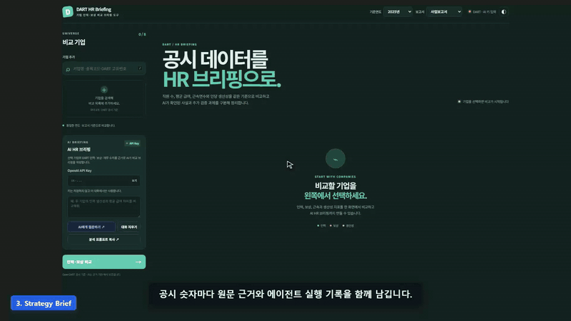
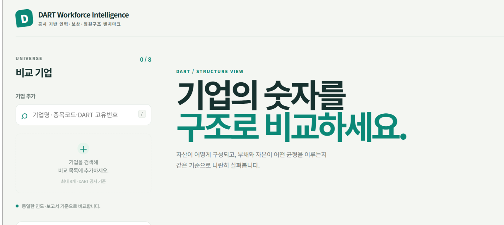

# DART Workforce Intelligence

공시 기반 인력·보상·임원구조 벤치마크를 시각적으로 탐색하는 People Analytics 프로그램입니다. OpenDART API에서 확인 가능한 기업 재무·인력·임원 공시를 같은 기준연도와 보고서 기준으로 묶어, HR 전략 가설을 만들 수 있는 화면으로 정리합니다.

<a href="https://github.com/koul777/dart-workforce-intelligence/raw/refs/heads/main/docs/demo.html"></a>

> 실제 앱을 headless Edge로 조작하고 자막·기능 라벨·가짜 커서·줌을 합성한 시연 티저입니다. GIF를 클릭하면 [브라우저용 시연 플레이어](https://github.com/koul777/dart-workforce-intelligence/raw/refs/heads/main/docs/demo.html)가 열립니다. [MP4 원본](docs/assets/dart-workforce-demo.mp4)은 별도로 내려받아 재생할 수 있습니다.

## 이 프로그램으로 무엇을 보나요?

이 프로그램은 사내 HRIS를 대체하거나 개인별 성과를 판정하는 도구가 아닙니다. 공개 공시의 집계값을 기업 단위로 비교해 다음 질문의 출발점을 제공합니다.

- 이익 체력과 평균 급여·인당 지표는 어떤 관계를 보이는가?
- 직원 수, 정규직 비중, 평균 근속, 평균 급여가 기업별로 어떻게 다른가?
- 등기·미등기 임원, 상근·비상근, 임기 만료 구조는 어떻게 구성되어 있는가?
- 성별 급여·근속 집계가 공시된 경우, 어떤 차이가 확인되며 무엇이 아직 검증되지 않았는가?
- 공시 수치로 세운 HR 전략 가설을 어떤 내부 데이터와 KPI로 추가 검증해야 하는가?

## 화면 구성

### 1. 기업 선택과 비교 기준

기업명·종목코드·DART 고유번호로 기업을 검색하고, 기준연도와 보고서 종류를 맞춘 뒤 비교를 실행합니다. 같은 기준으로 선택 기업을 조회하기 때문에 기업 간 숫자의 출처와 기준을 추적하기 쉽습니다.



### 2. 시각화 중심의 분석 탭

| 탭 | 핵심 시각화 | HR 전략에서의 활용 |
| --- | --- | --- |
| Overview | 핵심 KPI 카드와 기업 요약 | 비교 대상의 규모·수익성 빠른 파악 |
| Compare | 재무 구조 비교 카드·테이블 | 이익·부채·현금·자본의 차이 확인 |
| Trend | 연도별 선 그래프와 수치 표 | 최근 방향성과 구조 변화 탐색 |
| People | 직원 수·정규직·근속·급여 카드 | Workforce 규모와 보상 수준 비교 |
| Executives | 임원 구성·직위·등기·상근 현황 | 거버넌스와 리더십 구조 확인 |
| Strategy Brief | 이익 → People Signal → 보상 프레임 | HR 전략 가설과 추가 검증 과제 도출 |
| Radar / Scatter / Rank | 상대 레이더·산점·순위 시각화 | 여러 지표의 패턴과 이상치 탐색 |

### 3. Strategy Brief의 시각화 계층

참고 대시보드 `기업 비교 대시보드_v1.html`의 시각 언어와 정보 흐름을 반영해, Strategy Brief는 숫자를 한 번에 결론 내리기보다 실제 공시와 모델 추정을 층별로 분리합니다.

1. **Profit Capacity** — 영업이익, 영업이익률, 인당 영업이익, 평균 급여를 기업 카드로 비교합니다.
2. **Operating Profit** — 기업별 연도 영업이익 막대 그래프를 그리고, 다음연도 값은 해칭으로 구분합니다.
3. **Average Pay** — 평균 급여 연도별 SVG 라인 차트와 다음연도 전망 구간을 표시합니다.
4. **Pay Equity** — 성별 급여 비율·근속 차이·분석 표본을 공시된 경우에만 보여줍니다.
5. **Internal Diagnostics** — 평가·보상 원장·설문 등 내부 데이터가 필요한 영역은 잠금 상태로 명확히 표시합니다.
6. **Evidence / Orchestration** — DART 원문 링크, 품질 게이트, 에이전트 trace, 데이터 한계를 한 화면에서 확인합니다.

`E` 또는 해칭으로 표시된 값은 DART 확정 공시값이 아니라 최근 공개 추세를 화면에서 단순 연장한 모델 추정입니다. 투자·인사 의사결정용 확정 예측으로 사용하지 않습니다.

## AI 분석 질문은 무엇인가요?

사이드바의 **AI 분석 질문**은 별도의 데이터 입력창이 아니라, 현재 선택 기업의 DART 재무 수치와 People Analytics 집계값에 사용자의 질문을 붙이는 기능입니다. 예를 들면 다음과 같이 입력할 수 있습니다.

> 영업이익 증가와 평균 급여 변화가 함께 나타나는 기업과 그렇지 않은 기업을 구분하고, HR 전략 가설·추가 검증 데이터·KPI를 제안해줘.

실행 시 프로그램은 다음 정보를 포함한 분석 프롬프트를 구성합니다.

- 기준연도·보고서 코드와 기업별 재무 수치
- 직원 수, 정규직·계약직, 평균 근속, 평균 급여, 임원 공시
- 사용자가 입력한 질문
- 공시 누락·회계정책 차이·집계값의 한계를 구분하라는 해석 규칙

Claude MCP gateway가 연결되어 있으면 분석 결과를 표시하고, 연결되지 않은 기본 상태에서는 `not_configured`와 함께 복사 가능한 prompt handoff를 보여줍니다. AI는 DART 원자료를 대체하지 않으며, gateway 오류를 성공 결과로 표시하지 않습니다.

## 데이터 범위

현재 프로그램은 공개 OpenDART API만 사용합니다.

- 재무 단일회사 공시: `fnlttSinglAcnt.json`
- 직원 현황: `empSttus.json`
- 임원 현황: `exctvSttus.json`
- 미등기 임원 보수: `unrstExctvMendngSttus.json`
- 연도별 재무·People·임원 이력 API
- 임원별 이름·생년월·경력 등은 통계 목적의 기본 화면에 불필요하게 노출하지 않고 집계 중심으로 다룹니다.

## 실행 방법

### 가장 빠른 실행

Windows 배포 패키지를 실행합니다.

```powershell
.\dist\DARTStructure.exe
```

프로그램은 기본적으로 `http://127.0.0.1:8765`에서 실행됩니다.

### 개발 모드

Python 3.11 이상을 권장합니다.

```powershell
Copy-Item .env.example .env
# .env의 OPENDART_API_KEY에 OpenDART 인증키 입력
python server.py
```

개발 환경에 필요한 Python 패키지는 현재 실행 환경에 설치되어 있어야 하며, 배포 실행에는 별도 Python 설치가 필요하지 않습니다.

`.env`의 선택 설정은 별도 Claude MCP gateway가 있을 때만 사용합니다.

```text
OPENDART_API_KEY=
CLAUDE_MCP_GATEWAY_URL=
CLAUDE_MCP_GATEWAY_TOKEN=
CLAUDE_MCP_GATEWAY_TIMEOUT_SECONDS=20
```

인증키와 gateway token은 저장소에 커밋하지 않습니다. `.env.example`만 공유용으로 포함합니다.

## 품질 확인

현재 구현 상태에서 다음 검증을 통과했습니다.

```powershell
python -m unittest discover -v
ruff check server.py agent_orchestration.py workforce_analytics.py claude_mcp_adapter.py orchestrator.py test_*.py
python -m py_compile server.py agent_orchestration.py workforce_analytics.py claude_mcp_adapter.py orchestrator.py
node --check static/app.js
```

배포 패키지 smoke test에서는 health API, 재무·People context, AI prompt handoff, Strategy Brief 정적 자산을 확인했습니다. 시각 QA 체크리스트와 제한사항은 [`reports/visual_qa_20260821.md`](reports/visual_qa_20260821.md)에 기록되어 있습니다.

## 시연 영상 제작

시연 영상은 [demo-video-skill](https://github.com/Kminer2053/demo-video-skill)의 오픈소스 제작 원칙을 적용했습니다. 실제 앱을 Playwright headless 브라우저로 조작하면서 다음 흐름을 녹화합니다.

1. 기업 검색·선택
2. 삼성전자·SK하이닉스 DART 비교
3. KPI·막대 그래프 시각화
4. Strategy Brief의 이익·급여·Pay Equity 흐름
5. AI 분석 질문과 Claude MCP prompt handoff

재현하려면 개발 서버를 먼저 실행한 뒤, Node.js·`playwright-core`·Edge·`ffmpeg`가 준비된 환경에서 실행합니다.

```powershell
$env:APP = "http://127.0.0.1:8768"
$env:SCR = "C:\workspace\dart\video_work"
$env:CHROME_PATH = "C:\Program Files (x86)\Microsoft\Edge\Application\msedge.exe"
$env:PLAYWRIGHT_CORE = "C:\workspace\dart\video_work\node_modules\playwright-core"
node tools/capture_dart_demo.js all
```

녹화 원본과 중간 산출물은 `video_work/`에 두며 저장소에는 포함하지 않습니다. 최종 배포용 MP4·GIF만 `docs/assets/`에 저장합니다.

### 영상이 README에서 바로 재생되지 않을 때

GitHub README는 MP4를 일반적인 `<video>` 플레이어로 자동 재생하지 않을 수 있습니다. GIF는 README에서 바로 보이고, 전체 영상은 [raw 시연 플레이어](https://github.com/koul777/dart-workforce-intelligence/raw/refs/heads/main/docs/demo.html)를 열거나 [`docs/demo.html`](docs/demo.html)을 내려받아 브라우저로 열면 재생됩니다.

```powershell
python -m http.server --directory docs 8000
# 브라우저에서 http://127.0.0.1:8000/demo.html 접속
```

## 문서

- [`DART_WORKFORCE_INTELLIGENCE_PLAN.md`](DART_WORKFORCE_INTELLIGENCE_PLAN.md) — 제품 범위·데이터 계약·완료 기준
- [`DART_WORKFORCE_INTELLIGENCE_RUNBOOK.md`](DART_WORKFORCE_INTELLIGENCE_RUNBOOK.md) — 실행·시각 QA·AI gateway 점검 절차
- [`reports/visual_qa_20260821.md`](reports/visual_qa_20260821.md) — 자동 검증 및 브라우저 캡처 QA 기록
- [`orchestration-dart-claude.html`](orchestration-dart-claude.html) — DART·Claude MCP 오케스트레이션 참고 시각화

## 주의사항

공시는 기업이 공개한 집계 자료이므로 공시 누락, 보고서 기준 차이, 회계정책 차이, 표본 차이가 존재할 수 있습니다. 이 프로그램은 공시된 값의 비교와 HR 전략 가설 수립을 지원하며, 개인별 보상·성과·채용 적합성·성별 격차의 원인 또는 공정성을 판정하지 않습니다.
